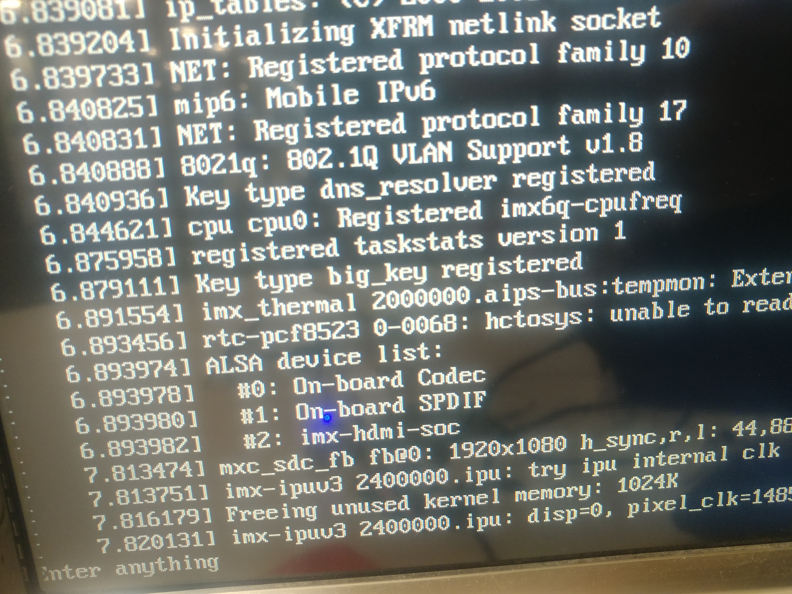
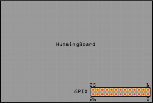

my-hummingboard-pro-playground
==============================


### Pinout (2 is 5V, 8 is TX, 10 is RX, 9 is GND, connect all 4 pins to USART-to-USB adapter PLUS make sure not USB power source / other power source connected)
- 

### HDMI (TLDR: `console=tty0` must added if want serial output to HDMI. Omit if use Linux headlessly)
- `setenv bootargs console=ttymxc0,115200 rw rootwait video=mxcfb0:dev=hdmi init=/init`
  - ```
    In:    serial
    Out:   serial
    Err:   serial
    ```
- `setenv bootargs console=ttymxc0,115200 rw rootwait video=mxcfb0:dev=hdmi console=tty0 init=/init`
  - ```
    In:    serial
    Out:   vga
    Err:   vga
    Net:   FEC
    ```

### Bootable
- [dirkarnez/bootable-img-creator](https://github.com/dirkarnez/bootable-img-creator)

### Kernel
- [ev3dev/flash-kernel: Fork of debian flash-kernel package](https://github.com/ev3dev/flash-kernel/tree/ev3dev-buster)
- [PartialVolume/shredos.x86_64 at 98c1fd0e45184a048d9e3d1367f482d9a9832b0b](https://github.com/PartialVolume/shredos.x86_64/tree/98c1fd0e45184a048d9e3d1367f482d9a9832b0b)
- [Yocto for i.MX6 - Developer Center -  SolidRun](https://solidrun.atlassian.net/wiki/spaces/developer/pages/287277558/Yocto+for+i.MX6)

### GPU programming
- `https://github.com/search?q=org%3AFreescale%20MXC_GPU_VIV&type=code`
- [nxp-imx/tim-vx-imx](https://github.com/nxp-imx/tim-vx-imx)
  - [./cmake/YOCTO.cmake](https://github.com/nxp-imx/tim-vx-imx/blob/lf-6.12.34_2.1.0/cmake/YOCTO.cmake)
  - [./cmake/local_sdk.cmake](https://github.com/nxp-imx/tim-vx-imx/blob/lf-6.12.34_2.1.0/cmake/local_sdk.cmake)
    - Using gpu-viv
  - [tim-vx-imx/.github/workflows/bazel_x86_vsim_unit_test.yml](https://github.com/nxp-imx/tim-vx-imx/blob/lf-6.12.34_2.1.0/.github/workflows/bazel_x86_vsim_unit_test.yml)
  - [tim-vx-imx/.github/workflows/cmake_x86_vsim.yml](https://github.com/nxp-imx/tim-vx-imx/blob/lf-6.12.34_2.1.0/.github/workflows/cmake_x86_vsim.yml)
  - [tim-vx-imx/samples at lf-6.12.34_2.1.0 · nxp-imx/tim-vx-imx](https://github.com/nxp-imx/tim-vx-imx/tree/lf-6.12.34_2.1.0/samples)
  - [TIM-VX/docs/Programming_Guide.md at main · VeriSilicon/TIM-VX](https://github.com/VeriSilicon/TIM-VX/blob/main/docs/Programming_Guide.md)
- [buildroot/package/freescale-imx at master · SolidRun/buildroot](https://github.com/SolidRun/buildroot/tree/master/package/freescale-imx)
- [**VeriSilicon/acuitylite: Acuitylite is an end-to-end neural network deployment tool**](https://github.com/VeriSilicon/acuitylite)
  - [demo.tflite — Acuitylite documentation](https://verisilicon.github.io/acuitylite/demo_tflite.html)
- [VeriSilicon/ZenCompiler: The ultimate AI compiler based on MLIR](https://github.com/VeriSilicon/ZenCompiler)
- [VeriSilicon/Vinaro: Vinaro open source SDK](https://github.com/VeriSilicon/Vinaro)
- https://solidrun.atlassian.net/wiki/spaces/developer/pages/286490753/i.MX6+GPU+VPU
- https://solidrun.atlassian.net/wiki/spaces/developer/pages/287178892/i.MX6+SOM+available+I+Os

### Spec
- https://solidrun.atlassian.net/wiki/spaces/developer/pages/294486017/i.MX6+PCB+rev+1.9+and+2.0+-+Analog+Devices+PHY
### Compiler (crosstools-ng's `arm-cortexa9_neon-linux-gnueabihf` should work, not yet tested)
- linux
  - arm-linux-gnueabihf
- u-boot
  - (aarch64-)arm-none-linux-gnueabihf

### Debian
- https://images.solid-run.com/Pure-Debian/armhf/12/2024-09-09_82780ea
  - [debian-builder/runme.sh at develop-pure · SolidRun/debian-builder](https://github.com/SolidRun/debian-builder/blob/develop-pure/runme.sh#L231)

### Rootfs
- https://github.com/PartialVolume/shredos.x86_64/blob/19d7f41b10a0cb76bd0d4bc2a1d49002d315a7ea/package/mfgtools/readme.txt#L33

### Boot script
- [Day 23 。初入嵌入式開發- 如何修改 BSP - Uboot 篇 - iT 邦幫忙::一起幫忙解決難題，拯救 IT 人的一天](https://ithelp.ithome.com.tw/articles/10344991)
  - a generic tutorial
- [Debian installer on i.MX6 boards | Ezurio](https://www.ezurio.com/documentation/debian-installer-on-i-mx6-boards)
- [6x-bootscripts/6x_bootscript-netboot.txt at master · boundarydevices/6x-bootscripts](https://github.com/boundarydevices/6x-bootscripts/blob/master/6x_bootscript-netboot.txt#L62)
- Debian (Note `setenv console "${console},${baudrate}"` below)
  - ```
    if test -n "${boot_targets}"; then
      echo "Mainline u-boot / new-style environment detected."
    else
      echo "Non-mainline u-boot or old-style mainline u-boot detected."
      echo "This boot script uses the unified bootcmd handling of mainline"
      echo "u-boot >=v2014.10, which is not available on your system."
      echo "Please boot the installer manually."
      exit 0
    fi
    
    if test -z "${fdtfile}"; then
      echo 'fdtfile environment variable not set. Aborting boot process.'
      exit 0
    fi
    
    if test -n "${distro_bootpart}"; then
      setenv partition "${distro_bootpart}"
    else
      setenv partition "${bootpart}"
    fi
    
    if test ! -e ${devtype} ${devnum}:${partition} dtbs/${fdtfile}; then
      echo "This installer medium does not contain a suitable device-tree file for"
      echo "this system (${fdtfile}). Aborting boot process."
      exit 0
    fi
    
    # Some i.MX6-based systems do not encode the baudrate in the console variable
    if test "${console}" = "ttymxc0" && test -n "${baudrate}"; then
      setenv console "${console},${baudrate}"
    fi
    
    if test -n "${console}"; then
      setenv bootargs "${bootargs} console=${console}"
    fi
    
    load ${devtype} ${devnum}:${partition} ${kernel_addr_r} vmlinuz \
    && load ${devtype} ${devnum}:${partition} ${fdt_addr_r} dtbs/${fdtfile} \
    && load ${devtype} ${devnum}:${partition} ${ramdisk_addr_r} initrd.gz \
    && echo "Booting the Debian installer..." \
    && bootz ${kernel_addr_r} ${ramdisk_addr_r}:${filesize} ${fdt_addr_r}

    ```

### rootfs
- https://github.com/motioneye-project/motioneyeos/blob/50ede5492e530b48966cf171b3a96dde7847b9d6/fs/cpio/init#L3
- https://github.com/motioneye-project/motioneyeos/blob/dev/writeimage.sh
- CONFIG_BLK_DEV_INITRD
- https://github.com/motioneye-project/motioneyeos/blob/50ede5492e530b48966cf171b3a96dde7847b9d6/board/nanopir1/uEnv.txt
- rootfs-overlay
- https://github.com/motioneye-project/motioneyeos/blob/50ede5492e530b48966cf171b3a96dde7847b9d6/docs/manual/customize-quick-guide.txt#L32
- BR2_ROOTFS_OVERLAY
- BR2_TARGET_ROOTFS_CPIO=y
- BR2_TARGET_ROOTFS_CPIO_GZIP=y
- https://github.com/motioneye-project/motioneyeos/blob/50ede5492e530b48966cf171b3a96dde7847b9d6/board/common/mkimage.sh#L30
- 
